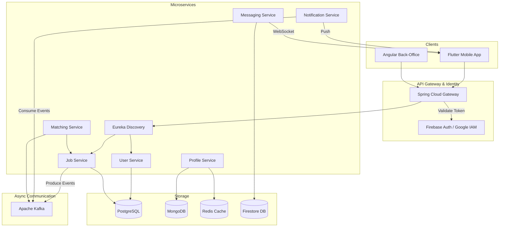

# SkillMatch Project Architecture

This document describes the global and technical architecture of the SkillMatch ecosystem.

## 1. Global System Architecture

The system follows a **Microservices Architecture** pattern, leveraging **Spring Cloud** for the backend, **Firebase** for identity and real-time data, and cross-platform clients (**Flutter** & **Angular**).

### Architectural Diagram (Eraser.io Code)

Paste the following code into [Eraser.io](https://www.eraser.io/) to generate the visualization:

---

## 2. Technical Component Breakdown

### A. Client Applications
- **Flutter Mobile App**: Main portal for Users and Providers. Communicates through the API Gateway using JWT tokens.
- **Angular Back-Office**: Admin dashboard for managing users, monitoring jobs, and sending manual system notifications. Features a Premium Dark Mode UI.

### B. Backend Services (Spring Boot 3.x)
| Service | Data Store | Key Responsibilities |
| :--- | :--- | :--- |
| **API Gateway** | Redis | Routing, CORS management, Rate Limiting, and Firebase token verification. |
| **User Service** | PostgreSQL | Local user profile sync, Role management (CLIENT, PROVIDER, ADMIN). |
| **Job Service** | PostgreSQL | CRUD operations for Jobs and Applications. |
| **Profile Service** | MongoDB | Document-based skill management and profile metadata. |
| **Notification Service** | PostgreSQL | Kafka consumer for system events; triggers FCM push notifications. |
| **Matching Service** | PostgreSQL | Compatibility algorithms to pair providers with jobs. |
| **Messaging Service** | Firestore | WebSocket handler for real-time chat and Firestore integration for persistence. |

### C. Infrastructure & DevOps
- **Service Discovery**: Netflix Eureka handles service registration and health checks.
- **Event Streaming**: Apache Kafka decouples services (e.g., Job creation triggers notifications without blocking).
- **Caching**: Redis is used for API Gateway rate limiting and performance optimization in the Profile service.
- **Deployment**: Configured for Docker Compose orchestration with specialized Dockerfiles for each environment.

---

## 3. Security Architecture
1. **Authentication**: Handled by Firebase Authentication.
2. **Authorization**: Gateway extracts roles from custom Firebase claims; services enforce `@PreAuthorize` based on roles (`ADMIN`, `PROVIDER`, `CLIENT`).
3. **Internal Security**: Communication between services happens via the Gateway OR via direct Eureka lookups with internal security filters.
